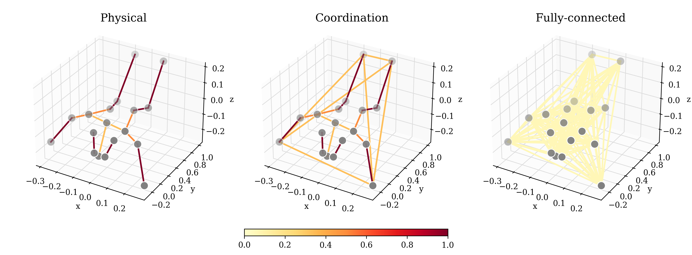

# infant-aagcn

[](https://arxiv.org/abs/2402.14400) [](https://doi.org/10.5281/zenodo.14269866)

PyTorch Lightning Implementation of Learning Developmental Age from 3D Infant Kinetics Using Adaptive Graph Neural Networks.



## Environment

### Cluster

Install or load a PyTorch module, then install packages. The `env.sh` script puts `bin/` on path where all executables reside.
```
module load pytorch/1.13
pip install -Ur requirements.txt
. ./env.sh
```

### Docker

```
docker run -v $(pwd):/work/infant-aagcn -w /work/infant-aagcn --user $(id -u):$(id -g) --gpus all --shm-size 16g -it infant-aagcn
```

## Data and models

Start by downloading the corresponding zip archives from [Zenodo](https://doi.org/10.5281/zenodo.14269866).

Unzip metadata:
```
unzip metadata.zip

metadata/
├── combined.csv
```

Unzip data:
```
unzip data.zip

data/
├── features.csv
├── streams
│   └── combined
│       ├── *.feather
├── streams_2d
    └── combined
        ├── *.feather
```

Unzip the results archive (to use already trained models):
```
unzip results.zip

results/
├── aagcn/
│   ├── fold_1/
│   │   ├── train_predictions.npy
│   │   ├── val_predictions.npy
│   │   ├── best_model.ckpt
│   │   ├── metadata.json
│   │   ├── ...
│   ├── ...
├── ...
```
The two most relevant models are `jb-aagcn-coord-xy` (2D) and `jb-aagcn-coord` (3D).

Unzip MNI predictions for the 2D and 3D models:
```
unzip predictions.zip

predictions/
├── jb-aagcn-coord-xy_predictions.csv
├── jb-aagcn-coord_predictions.csv
```

### Preprocessing

Open data has already been preprocessed. For completeness the steps applied to raw data were:
```
unzip.sh
preprocess.sh
```
Currently one of the preprocessing scripts, `bin/augment.py`, has `-n 0` rotations applied. Augmentations could be worthwhile exploring in future work.

## Train and predict

Example command to train the `JB-AAGCN` model on typical infants:
```
train.py \
  --data-dir data/streams/combined \
  --output-dir results/jb-aagcn-coord \
  --streams j,b \
  --adaptive \
  --attention \
  --edges coord
```

Then run predictions on MNI subjects:
```
predict.py --model-dir results/jb-aagcn-coord --output-dir predictions
```

The scripts above select data segments based on the outcome in `metadata/combined.csv` where 0 to 1 is typical or at most minor impairment and 2 denotes MNI.

The `notebook/` folder contains Jupyter notebooks for the ML baseline, AAGCN graph inspection, rotation preprocessing and metrics calculation.

The results presented in the paper has been produced using the submit scripts in the `run/` folder.

## Cite

```BibTeX
@article{holmberg2024learning,
  title={Learning Developmental Age from 3D Infant Kinetics Using Adaptive Graph Neural Networks },
  author={Daniel Holmberg and Manu Airaksinen and Viviana Marchi and Andrea Guzzetta and Anna Kivi and Leena Haataja and Sampsa Vanhatalo and Teemu Roos},
  journal={arXiv preprint arXiv:2402.14400},
  year={2024}
}
```
