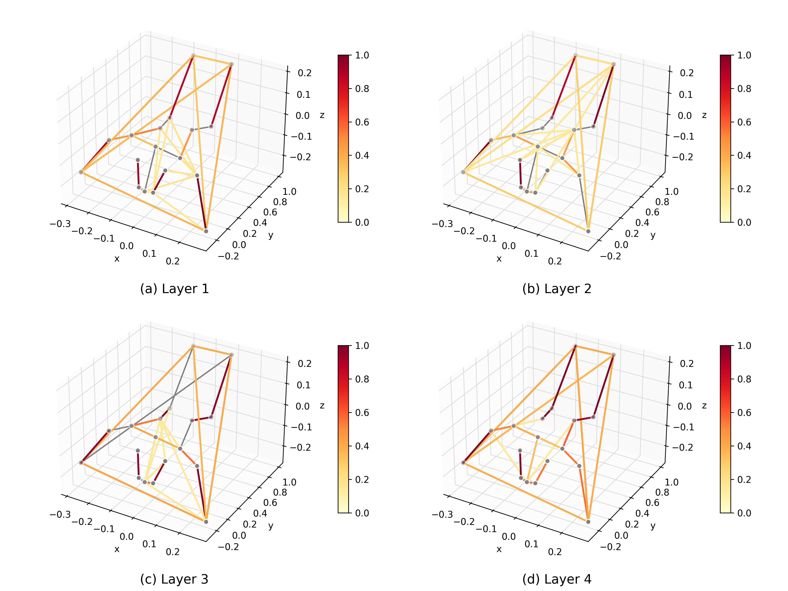

# infant-aagcn

[](https://arxiv.org/abs/xxxx.xxxxx)

PyTorch Implementation of Modeling 3D Infant Kinetics Using Adaptive
Graph Convolutional Networks.



## Environment

### Cluster

```
module load pytorch/1.13
pip install -Ur requirements.txt
. ./env.sh
```

### Docker

```
docker run -v $(pwd):/work/infant-stgnn -w /work/infant-stgnn --user $(id -u):$(id -g) --gpus all --shm-size 16g -it infant-aagcn
```

## Preprocessing

Data (2 zip archives, 4.8GB) available upon request. Preprocessing expects .csv files with joint coordinates over time.

```
./unzip.sh
./preprocess.sh
```

- Extract zip archives
- Select time intervals
- Center skeleton around neck joint
- Rotate around principal axes
- Create feature streams

## Training

By running the env script bin is put on path where all executables reside. The modules folder contain the models and dataloader etc. 

```
train.py \
  --data-dir data/streams/combined \
  --output-dir results/aagcn \
  --age-file metadata/combined.csv \
  --learning-rate 0.01 \
  --batch-size 32 \
  --num-workers 16 \
  --streams j \
  --k-folds 10 \
  --epochs 20 \
  --adaptive \
  --attention
```

Slurm: `sbatch run/submit.sh` or for the full comparison `sbatch run/experiment.sh`

Training creates a results folder with all runs. The noteboom folder then contain separate files for the ml baseline, aagcn inference and metrics calculation.

An example of how the models can be called to make predictions is avaialable in the submit script `run/predict.sh`.

## Cite

```BibTeX
@article{holmberg2024modeling,
  title={Modeling 3D Infant Kinetics Using Adaptive Graph Convolutional Networks},
  author={Daniel Holmberg and Manu Airaksinen and Viviana Marchi and Andrea Guzzetta and Anna Kivi and Leena Haataja and Sampsa Vanhatalo and Teemu Roos},
  journal={arXiv preprint arXiv:xxxx.xxxxx},
  year={2024}
}
```
